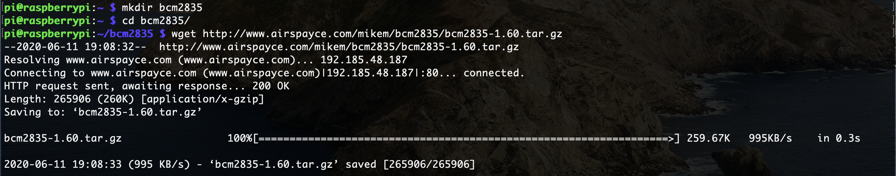
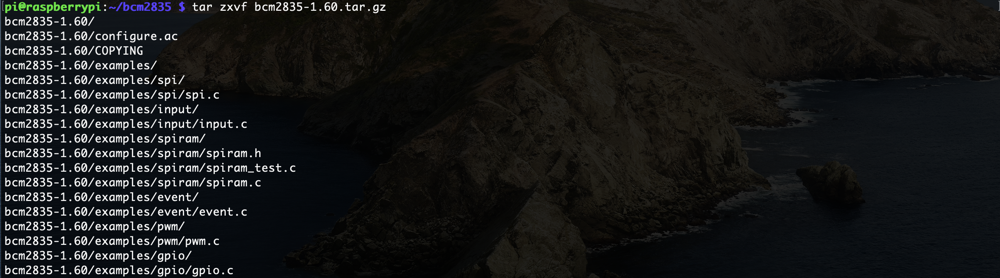
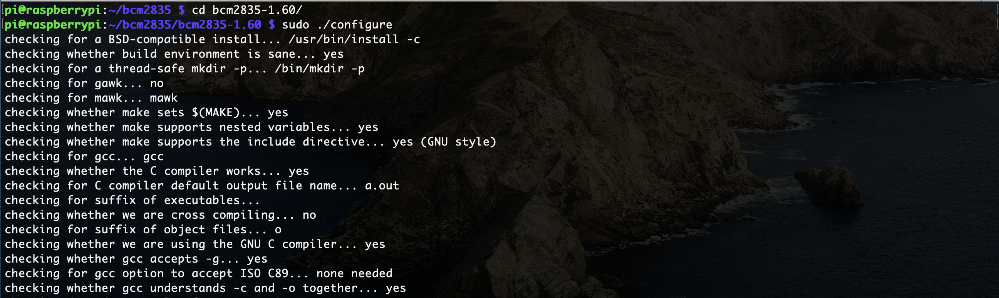
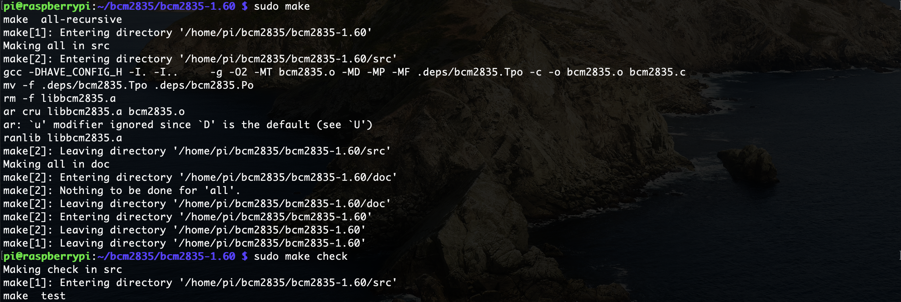
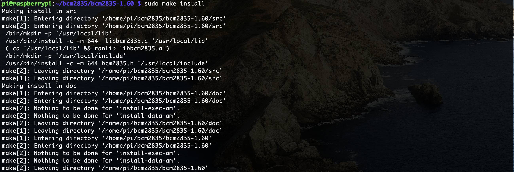
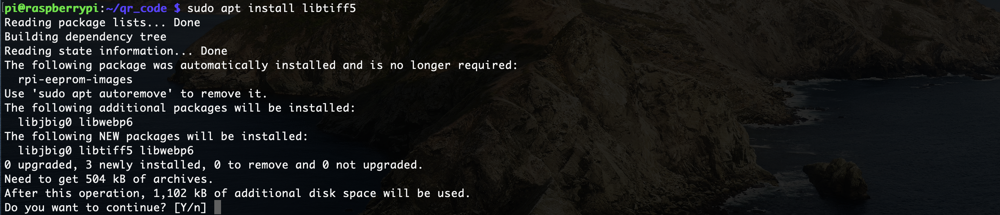
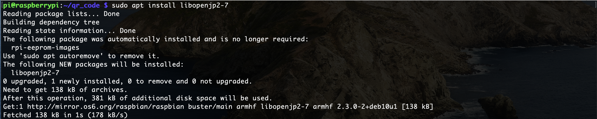
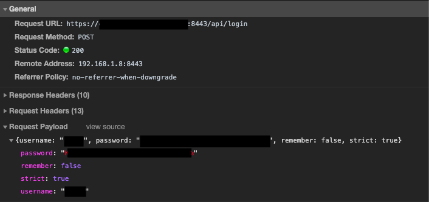
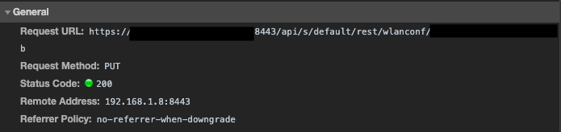
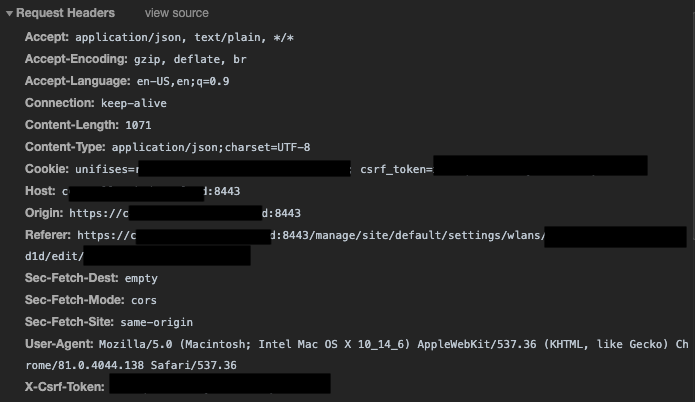

# WELCOME TO WIFI_QR
I made this for fun over the course of a couple of days because I've always wished my guest wifi network was 

1. easier for guests to join
2. more secure

If that sounds like you, read on!

### What is WIFI_QR?
WIFI_QR is a little project that automatically updates my guest wifi password to a random string of characters on a predefined schedule (I have it set to once a week or on each reboot). It also generates a QR code that can be read by phones to automatically join my guest network. Its two main components are a raspberry pi zero w and an e-paper screen...the rest is just code. From the front and back respectively, the finished product looks like this:

### How can you use it?
Well that's a little tricky, so I'll give you the quick version which probably won't work for you, and then I'll give you the long version which you will likely need to replicate (at least in part)

### Required parts
* [Raspberry Pi Zero](https://www.amazon.com/Raspberry-Pi-Zero-Wireless-model/dp/B06XFZC3BX) + [Pins](https://www.amazon.com/Frienda-Break-Away-Connector-Compatible-Raspberry/dp/B083DYVWDN) or [Pre-soldered Raspberry Pi Zero](https://www.amazon.com/Raspberry-Pi-Zero-WH-pre-soldered/dp/B07NY4WN6W)
* [E-Ink screen](https://www.amazon.com/Waveshare-Module-Resolution-Electronic-Interface/dp/B0751J99PS)
* [Power supply](https://www.amazon.com/Raspberry-Model-Official-SC0218-Accessory/dp/B07W8XHMJZ)

### Quick(ish) version
1. Have a Unifi network (if you don't you'll need to refer to the long version before moving to step 2)
2. Connect your screen to your pi (in my case this meant soldering some pins on following [the specified pinout](https://www.waveshare.com/wiki/4.2inch_e-Paper_Module))
3. Download the required Python modules for your screen
4. Clone the `WIFI_QR` repo on to your raspberry pi
5. Install a few drivers you'll need (these ones specific to the screen / software I used)
            
    `wget http://www.airspayce.com/mikem/bcm2835/bcm2835-1.60.tar.gz`
    
    
    
    `tar zxvf bcm2835-1.60.tar.gz`
    
    
    
    `cd bcm2835-1.60`
    
    `sudo ./configure`
    
    
    
    `sudo make`
    
    `sudo make check`
    
    
    
    `sudo make install`
    
    
    
    `sudo apt install libtiff5`
    
    
    
    `sudo apt install libopenjp2-7`
    
    
6. Add required login information and whatever settings you prefer to `config.ini`
7. Install requirements with `python3 -m pip install -r requirements.txt`
8. Copy the [epd modules related to your screen](https://github.com/soonuse/epd-library-python) to the directory containing the rest of the code
9. Create a cron job to your liking (an example is provided in the repo under `crontab`) with `crontab -e`

### Longer version
If you're here it's possibly because you read step 1 of the quick version and realized you are out of luck. Fortunately it shouldn't be _that_ difficult for you to fix compatibility. The main reason this would only work for a Unifi network is that the specific network requests I made in `network_update.py` were made to update my Unifi Cloud Key controller. You might need to make different requests, so I'll start with how I found what I needed to find, and then I'll point to what part of the code you might need to change.

#### Determining network requests
Like I mentioned, I have a Unifi Cloud Key for managing my Unifi network. If you don't know if you have that, or don't know how to find out if you have that, it's totally fine (chances are you don't have it). Type `192.168.1.1` in your browser and you will probably see a login page for your management interface (if you don't see anything try `192.168.0.1`)

When you get there, hopefully you'll have the credentials you need to log in; if not, it is possible that this information is printed somewhere on your modem / router. Before you log in, right click the page somewhere and click "Inspect", and in the developer tools that come up, navigate to the network tab. This allows you to see the network request that you submit when you log in. Mine looked like this:

Then you'll have to figure out where within that interface you can change the wifi password, and again check out the network request that you submit when you apply that change. Most important to this step is making sure that your request includes whatever authorization was required to make the request. In my case, the response body of my login request had a cookie and a token in it. If I add both of them to my "change password" request, the network controller knows that I'm authorized to make this change. This is handled in my python code, but the first time around I had to do a little discovery. My "password change" request looked like this (it had a lot of options so its a few screenshots):

#### Code to handle the requests
I was pretty lucky in that the network requests were relatively straightforward. I log in to my controller, get a cookie value and a token, add those to my "change" request (along with the network id and the desired password) and I'm done! If you aren't using a Unifi stack though, you'll probably have to change the `network_update.py` script accordingly.

#### Generate a QR code
This part is fortunately really easy if you use Python like I did. There's a pretty great library that does almost all of the work for you, but see my `password_and_qr_generate.py` if you need a place to start.

#### Fixing the screen
Soldering part aside, I actually had a little trouble getting my screen to work because there were a lot of moving parts. First, the waveshare e-paper screen's python modules are.....interestingly designed, and I didn't like they way it worked out of the box. So I edited the modules they give you. The TLDR is that I moved the module related to my screen size into my working directory, and then changed how they import the config so that it points to the right place. After that I found the code they provided to be a little hard to understand, so I started from scratch and only did what I needed to load and display my QR code.

#### What's with the bash script and the cron job?
I separated the code for this project in a way that seemed logical to me at the time, but then realized that meant I would need a few cron jobs to run in a specific order to get the desired result - do all the things on some regular cadence. Instead I wrote a really quick bash script that chains all three Python scripts together and called it from the cron job. Realistically you don't have to do it this way, but I only wanted each step of the process to run if they other once succeeded. `&&` provides a really easy way to do that in bash, so that's what I chose to do.
